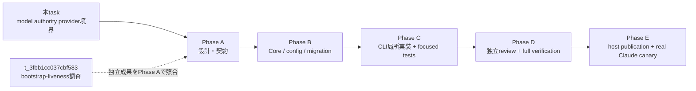

# Claude handover successor の model authority 設計

- 状態: **調査・推奨案。オーケストレーター採択 / contract 化前**
- 対象 task: `t_726b6b4970689d5f`
- 基準 SHA: `2ec2f950745400691d4c782ffeeac9df65ca5489`（調査時の `HEAD` / `origin/main` と一致）
- 対象経路: `hachi orchestrator handover` が起動する Claude/tmux 後継
- 非対象: 本文書による CLI/config/DB/contract/host 設定の変更、実 handover/canary、Codex successor の model 選択

## 1. 結論

**Hachi config の Claude successor 用 model/window ペアを policy authority とし、1回の handover が使う値を
durable successor slot へ arm 時に snapshot する。snapshot した full model ID を `claude --model` へ明示し、
nonce 一致後の最初の assistant 行から実 model ID を読み、expected と exact 一致した場合だけ既存の
`claude-delivery` attest/final を許可する。final では model/window と authority hash を successor session へコピーする。**

この方式は次の4層を分離する。

1. **policy**: host が人間承認 gate で公開した exact model ID と正の context window のペア。
2. **launch intent**: arm transaction が policy のペアと hash を durable slot に固定する。
3. **runtime evidence**: prompt nonce と同じ transcript の最初の assistant 行が返した model ID。
4. **session measurement**: final transaction が固定済み window を successor session にコピーし、後日の
   `orchestrator usage` は current context の実測 model が session snapshot の model と exact 一致する場合だけ、
   current config ではなく session snapshot の window を使う。

ただし、この4層と `model_authority_version=1` の必須 field を共有 successor 契約へ一律適用しない。
適用 predicate は、slot arm 時に固定した discriminator が
`targetProvider=claude && expectedProviderSessionSource=claude-delivery && launchKind=handoff` と exact 一致する場合だけである。
Codex `codex-session-start`、Claude/Codex takeover、manual、migration 前 legacy は非対象とし、現行 attestation/final/usage を
維持する。unknown/partial discriminator を Claude とみなす fallback は禁止し、後述の provider 別 fail-closed 分岐へ送る。

任意文字列を受け取る handover `--model` option は作らない。`hachi admin resolve`、task profile、Claude user setting、
cwd の直近状態も successor model authority にしない。model alias と context window の対応表も作らない。

Claude 2.1.231 の transcript は実 model ID を返すが context window 値を返さない。したがって本設計で
runtime readback できるのは model ID までである。window は「host が承認した model/window ペアの assertion」であり、
provider-native 観測値とは呼ばない。window の根拠を host publication で承認できなければ config を公開せず、
handover を fail-closed に止める。将来 provider が window を返す場合だけ、observed window の exact 一致を final 条件へ足す。

## 2. Current-main fact table

| # | 現行事実 | 証拠 | 含意 |
|---|---|---|---|
| F1 | 調査時の `HEAD` とローカル `origin/main` は基準 SHA と同じ | `git rev-parse HEAD origin/main` → `2ec2f950...` / `2ec2f950...` | 以下は stale issue-time code ではなく指定 current main の事実 |
| F2 | `buildTmuxArgs` は barrier shell の後に `claude --session-id "$2" -- "$3"` を実行し、`--model` を含まない | `packages/cli/src/commands/orchestrator.ts:1542-1565` | Hachi は後継 model を launch argv で固定していない |
| F3 | handover command に model option は無い | `packages/cli/src/commands/orchestrator.ts:1102-1107`, `packages/cli/src/commands/orchestrator.ts:2267-2275` | current CLI から successor model を選ぶ authority 面は存在しない |
| F4 | dry-run と apply は同じ `tmuxArgs` を使い、focused test は配列全体の一致を検証する | `packages/cli/src/commands/orchestrator.ts:1928-1937`, `packages/cli/src/commands/orchestrator-handover.test.ts:1698-1751` | model を加える場合も builder は一か所のままにする |
| F5 | provider preflight は source session が Claude かだけを検証し、model/config/readback は検証しない | `packages/cli/src/commands/orchestrator.ts:1950-1965`, `packages/cli/src/commands/orchestrator-handover.test.ts:1166-1238` | `provider-launchable` は維持し、別の model-authority check を足す必要がある |
| F6 | apply は raw prompt/argv を出力から redaction し、slot arm → exact runtime bind → delivery → final を呼ぶ | `packages/cli/src/commands/orchestrator.ts:2069-2110` | model は非 secret だが、既存 token/nonce redaction を弱めてはならない |
| F7 | nonce 一致 user 行の後に assistant 行があることだけで delivery confirmed になり、assistant の model は読まない | `packages/cli/src/orchestrator-handoff-delivery.ts:47-100` | 現在は Haiku 応答でも delivery gate を通り得る |
| F8 | delivery 後の `claude-delivery` attest、claim、atomic final は親 CLI が行う | `packages/cli/src/commands/orchestrator-successor-launch.ts:857-940`, `packages/cli/src/commands/orchestrator.ts:2086-2179`, `runbooks/orchestrator-playbook.md:530-576` | 後継自身の generic `handoff-accept` は現行問題ではない。model gate は parent final の直前へ接続する |
| F9 | durable slot v23 は expected cwd/host/runtime/hash/fence を持つが model/window 列を持たない | `docs/contract.md:3799-3875`, `packages/core/src/db.ts:2067-2130`, `packages/core/src/types.ts:322-378` | config だけの修正では config drift と crash recovery に耐えない。migration が必要 |
| F10 | final は trusted provider pair と slot/runtime/fence を再検証し、successor 作成・claim 移管・slot succeeded を原子的に行う | `docs/contract.md:3923-3966` | model/window も同じ final transaction の再検証対象に加える。新しい並行 state machine は作らない |
| F11 | exact rollback は owner 一致と tmux/session/PID/PGID の三点停止が揃うまで replacement を閉じる | `docs/contract.md:3949-3976`, `packages/cli/src/commands/orchestrator-handover.test.ts:2023-2227` | model mismatch も既存 `stop_pending -> stopped|uncertain` へ流す |
| F12 | host の current Claude user setting は `model=opus[1m]` | `~/.claude/settings.json:81`（2026-08-26 read-only snapshot） | incident 時点の選択を証明しない。successor authority にも使わない |
| F13 | host の current Hachi budget window は `1000000` | `~/.hachi-kanban/config.json:278-282`（2026-08-26 read-only snapshot） | 現キーは measurement fallback であり launch model と原子的に結び付いていない |
| F14 | `orchestrator usage` は native observation の window が無い場合に `sessionBudget.contextWindowTokens` を使うだけで、launch を制御しない | `packages/cli/src/commands/orchestrator-usage.ts:148-183` | current 1M 値は successor model authority ではない |
| F15 | Claude native collector は transcript の model を実測するが、window は返らないためモデル名逆引きを禁止している | `packages/adapters/src/native-usage.ts:466-530`, `packages/adapters/src/native-usage.ts:553-651`, `packages/adapters/src/native-usage.ts:391-401` | runtime model exact match は可能。runtime window exact match は現状不可能 |
| F16 | `hachi admin resolve` の決定表は worker/reviewer 用で、登録済み orchestrator session を変更しない | `runbooks/orchestrator-reference.md:11-16`; task event `15083` と current resolve は worker/reviewer routing を記録 | task routing を successor authority に流用しない |
| F17 | host の Claude CLI は 2.1.231 で、`--model <model>` は alias または full model name を受けると help に表示する | host 実測 `claude --version`; `claude --help` の `--model` entry（2026-08-26） | explicit argv を作れる。ただし特定 model/window の有効性は live canary で証明する |
| F18 | board comment は同一 cwd の `lastModelUsage` に Haiku と Opus が並存し、選択中 model の明示 key が無いことを保存している | task `t_726b6b4970689d5f` comment `3246` | cwd 状態説とは整合するが、`lastModelUsage` は aggregate であり precedence の決定証拠ではない |
| F19 | 最新オーケストレーターは current main でも `buildTmuxArgs` に `--model` が無いと再確認し、本調査を model/window/durable readback の分離 phase にした | task comment `3413`; worktree/routing 固定は comment `3427` | 本文書の判断範囲と ownership は board 指示どおり |
| F20 | reference §0.7.5 の token/generic accept 説明は current playbook/code より古い | `runbooks/orchestrator-reference.md:139-186`, `runbooks/orchestrator-reference.md:209-210` 対 `runbooks/orchestrator-playbook.md:530-576` | contract phase で文面を追随させるが、generic accept を本設計の未解決項目へ戻さない |
| F21 | current `orchestrator usage` は native window が無いと config window を無条件に選び、`usage.contextModel` と session 側 model の照合面を持たない | `packages/cli/src/commands/orchestrator-usage.ts:148-183`; `packages/adapters/src/native-usage.ts:391-401` | durable window を足すだけでは、session 中の model drift 後に別 model の window を誤適用できる。selection 前の exact-model gate が必要 |

## 3. 2026-08-25 incident の追跡

### 3.1 保存済み evidence chain

全文 transcript は読まず、exact session と必要 field だけを抽出した。

| 時刻（JST） | evidence | 観測 |
|---|---|---|
| 2026-08-25 16:58:43 | provider session `21c6d2f3-9e38-49eb-a294-374c8952b501` の nonce-bearing user row | cwd=`~/develop/tenant-a`, Claude CLI 2.1.231, mission=`t_168e984f557960d8`, source board session=`os_fcd485d55b4e6e4b`, provider session ID は filename/sessionId と exact 一致 |
| 2026-08-25 16:58:52 | 同じ exact transcript の最初の assistant row | `message.model=claude-haiku-4-5-20251001`。message/usage key には context window 値が無い |
| 2026-08-25 17:03:44 | board session row `os_e4dc4691a9b85e11` generation 10 | provider session ID=`21c6...`, provider=`claude`, source=`manual` として作成 |
| 2026-08-25 17:05:20 | 同 board session row | status=`stale`。作成から96秒 |
| 2026-08-25 17:07:04 | task comment `3246` | 同じ cwd で安い model を使った後に handover がその model を引き継ぎ得る、というユーザー観測と再現条件を保存 |

historical board row の `providerSessionSource=manual` は incident 当時の経路の記録である。current main は F8 の
parent-owned `claude-delivery` final へ更新済みなので、manual source や successor generic accept を今回の修正対象にしない。

### 3.2 Root cause の確度

| 主張 | 確度 | 根拠 / 不足 |
|---|---|---|
| Hachi が successor model を指定しなかった | **確定** | F2/F3 と §3.1 の exact launch metadata |
| successor の最初の provider 応答が Haiku だった | **確定** | exact session の最初の post-prompt assistant metadata |
| Haiku session が board generation 10 に結び付いた後、短時間で stale になった | **確定** | board session `os_e4dc...` の provider ID / timestamp / status |
| cwd の直近 model 状態が Haiku 選択を引き起こした | **有力だが未確定** | comment `3246` と `.claude.json` metadata は整合するが、`lastModelUsage` は aggregate。選択 key/precedence trace は無い |
| user setting `opus[1m]` より cwd 状態が常に優先される | **不明** | incident 時の settings snapshot、env、Claude 内部 decision trace が無い。current settings は翌日の snapshot |
| Haiku の能力差だけが stale の唯一原因だった | **不明** | bounded metadata は model/status まで。assistant 本文や全 transcript を読んでおらず、heartbeat/monitor 側の独立要因を排除していない |

したがって根本欠陥は「Claude の隠れた precedence が何か」ではなく、**Hachi が model intent と runtime evidence を
authority plane に持たず、provider fallback を成功として final できること**である。内部 precedence の完全解明は修正の
前提にしない。

### 3.3 Precedence を追加調査する場合の bounded canary

内部 precedence 自体を知る必要が生じた場合だけ、production mission と別の trusted canary cwd/session を使う。

1. user setting と env の non-secret model-related key 名だけを snapshot する。
2. canary cwd で人間が承認した安い full model IDを `--model` で1回起動し、最初の assistant model と終了を記録する。
3. 同じ cwd で `--model` 無しを1回起動し、exact session の最初の assistant model だけを読む。
4. fresh cwd の `--model` 無しと比較する。
5. `--model <expected-full-id>` では seeded cwd に関係なく exact expected model になることを確認する。

各 run は session ID、cwd、CLI version、最初の assistant timestamp/model だけを保存し、prompt、token、全 transcript は
収集しない。この canary が無くても、以下の推奨設計は成立する。

## 4. Authority 案の比較

| 案 | 利点 | 失敗境界 | 評価 |
|---|---|---|---|
| A. host/user setting 依存 | 実装不要。通常の手動 Claude 起動と同じ | cwd state/env/settings drift を slot に固定できず、incident と同じ silent fallback。window と model の対応も durable でない | **不採用** |
| B. handover CLI `--model <arbitrary>` | argv で明示でき、その1回の意図は見やすい | 呼出しごとの typo/alias/automation差、dry-run/apply差、HHN の素通し、publication gate 迂回。window と分離し、slot 保存/readback が無ければ監査不能 | **不採用**。raw option 自体を作らない |
| C. Hachi config の model/window ペア | host policy を一か所に置き、両値を atomic validation できる。missing/partial を事前に止められる | config だけでは arm 後の drift、crash resume、actual provider model を証明できない | **必要だが単独では不足** |
| D. durable slot/session の expected pair + runtime readback | 1 attempt の intent、actual model、後日の usage を同じ fence に結び付け、final CAS/rollback を再利用できる | DB/type/migration が必要。Claude は window を返さないため window は host assertion のまま | **採用する実行形** |

**推奨は C を policy root、D を execution authority として組み合わせる。** B のような ad hoc override は置かず、
A は診断情報としても final 条件に使わない。

## 5. 提案する契約差分

### 5.1 Config authority

新しい provider-specific key を次の形に固定する。

```text
{
  "orchestrator": {
    "claudeSuccessor": {
      "model": "<provider が transcript に返す full model ID>",
      "contextWindowTokens": <host が承認した正の整数>
    }
  }
}
```

規則:

- `claudeSuccessor` object 自体は binary 起動互換のため optional とするが、Claude handover の dry-run/apply では必須。
  missing は `successor-model-authority` preflight を false にし、slot/process を作らない。
- object がある場合は `model` と `contextWindowTokens` の両方を required にする。partial、unknown key、
  非正整数 window は config load で拒否する。v1 の full ID grammar は
  `^claude-[A-Za-z0-9][A-Za-z0-9._\[\]-]{0,199}$` とし、alias、空白、control文字は受理しない。
- `model` は alias ではなく、runtime `message.model` と byte-for-byte 比較する full ID とする。Hachi は alias 展開しない。
- `contextWindowTokens` は model から計算しない。host publication が exact pair を承認した値だけを置く。
- `orchestrator.sessionBudget.contextWindowTokens` は legacy/manual measurement fallback として残すが、successor launch の
  authority には使わない。
- current `allowlist.claude`、`modelTransportPolicies`、task `admin resolve` は worker/reviewer execution policy であり、
  `claudeSuccessor` の代替にしない。
- config pair の canonical JSON
  `{"model":<JSON string>,"contextWindowTokens":<base-10 integer>}`（この key 順・空白なし）の UTF-8 bytes から
  `modelAuthorityHash` を計算する。raw secret は含まれず、slot/session/JSON に出してよい。

### 5.2 Durable slot と session

contract §70〜§73 の state machine、replacement gate、secret boundary、final/rollback を変更せず、追加 invariant を
新しい §75 `Claude successor model/window authority` として定義する。既存節には参照だけを加える。

migration v24（番号は実装時の current main と衝突確認後に確定）で、少なくとも次を持つ。

```text
orchestrator_successor_launches
  successor_discriminator_version  0=pre-v24 legacy, 1=arm-snapshot-v1
  expected_provider_session_source  '' | codex-session-start | claude-delivery
  # target_provider と kind は既存列を discriminator の残り2要素として使う
  model_authority_version          0=legacy, 1=config-pair-v1
  expected_model_id                full provider model ID
  expected_context_window_tokens   positive integer
  model_authority_hash             sha256(canonical pair)
  observed_model_id                post-nonce first assistant model
  model_observed_at                Hachi が exact transcript row を観測した時刻

orchestrator_sessions
  successor_discriminator_version  0=manual/pre-v24 legacy, 1=successor-final snapshot
  successor_launch_kind            '' | handoff | takeover
  # provider と provider_session_source は既存列を discriminator の残り2要素として使う
  model_id                          final で一致済み observed model
  context_window_tokens             slot の expected window
  model_authority_hash              slot の hash
  model_authority_source            '' | 'successor-launch'
```

- discriminator の意味は slot/session で同一にする。slot では
  `(target_provider, expected_provider_session_source, kind)`、session では final がコピーした
  `(provider, provider_session_source, successor_launch_kind)` を使う。attest の入力や current config から再構成しない。
- new arm は provider 固有 constructor が `successor_discriminator_version=1` と3要素を source session/fence と同じ
  transaction で保存する。Claude handover は exact `(claude, claude-delivery, handoff)`、Codex start は
  `(codex, codex-session-start, handoff|takeover)` とする。Claude takeover は現行共有 Core 契約を保つ既知非対象
  `(claude, claude-delivery, takeover)` とし、model authority を適用しない。caller が source を自由指定する面は作らない。
- model authority の適用 predicate `P` は discriminator version や model field の有無から推測せず、
  `provider=claude && providerSessionSource=claude-delivery && launchKind=handoff` の exact 一致だけで判定する。
  new arm で `P=true` なら `model_authority_version=1` と expected pair/hash を同じ transaction で必須保存する。
  `P=false` の既知 Codex/takeover row は model field を必須化せず、null/空のまま許可する。
- migration が付ける discriminator version 0 は明示的な legacy class であり、新しい arm API は生成できない。
  version 1 の source 欠落、未列挙 provider/source/kind、slot の expected source と attest input source の不一致は
  `P=false` の互換経路へ落とさず invalid discriminator とする。

| 保存済み class | discriminator | Claude model/window gate | attest/final/usage |
|---|---|---|---|
| Claude handover v1 | version 1 + `(claude,claude-delivery,handoff)` | **適用**。`model_authority_version=1`、exact runtime model、usage exact-model が必須 | 各段が同じ snapshot を再検証。不成立は rollback / unmeasured |
| Codex successor v1 | version 1 + `(codex,codex-session-start,handoff|takeover)` | **非適用** | 現行 Codex handle/final と usage resolution を維持 |
| Claude takeover v1 | version 1 + `(claude,claude-delivery,takeover)` | **非適用** | 現行共有 Core 契約を維持。model/window は合成しない |
| manual / pre-v24 legacy | version 0。source/kind の空値を許す | **非適用** | 新fieldを要求せず現行互換。値から version 1 を推測しない |
| invalid v1 | partial、unknown、未列挙 combination、snapshot/input mismatch | 適用/非適用へ分類しない | Claude/legacyへfallbackせず attest/final veto。usageはprovider window以外unmeasured |

- argv builder は **slot/config snapshot と同じ `expectedModelId`** を使う。arm 後に live config を再読込しない。
- delivery probe は nonce 一致後の最初の assistant row の `message.model` を allowlist 抽出し、slot へ observed model/time を
  exact CAS で記録する。
- attest は保存済み discriminator を先に分類し、input source と snapshot source の exact 一致を全 version 1 row で要求する。
  `P=true` のときだけ `attested` への遷移条件へ `model_authority_version=1`, expected model 非空, window>0,
  observed model 非空, `observed_model_id === expected_model_id` を加える。既知 Codex/takeover と version 0 legacy は
  この Claude-only field gate を通さず、現行 provider/runtime/handle 条件だけを使う。
- final transaction は同じ保存済み discriminator と分類を再利用する。`P=true` のときだけ model 条件を再検証し、
  successor session へ discriminator と model/window/hash/source を一括コピーする。既知非対象では discriminator だけを
  コピーし、Claude-only model field を要求・合成しない。
  一部だけの copy や final 後の補正は禁止する。
- invalid discriminator は attest mutation 0、または親CLIが exact slotを識別できる場合は即 `stop_pending` とし、
  outer timeout/既存 exact rollback に収束させる。final で初めて検出した場合も final mutationを vetoして同じ rollbackへ送る。
- model mismatch/missing/read error は delivery failure とし、既存の `stop_pending -> stopped|uncertain` を使う。
  mismatch 用の parallel cancel state machine や generic kill は作らない。
- raw handoff token、launch/owner nonce、accept/stop fence の保存・redaction規則はそのまま。model/window/hash は
  non-secret だが、apply 後の raw prompt/argv redaction は維持する。

### 5.3 Launch argv と preflight

builder の shell/argv 形は次にする。model も prompt も positional argument とし、shell text へ連結しない。

```text
/bin/sh -c 'tmux wait-for "$1" && exec claude --session-id "$2" --model "$3" -- "$4"' \
  hachi-successor <barrier> <providerSessionId> <expectedFullModelId> <startupPrompt>
```

- `--` は model option の後、prompt の直前に維持する。
- dry-run 表示と apply の launch は同じ `buildTmuxArgs` を通す。
- preflight は既存9項目を残し、`successor-model-authority` を `tmux-command-size` より前に追加する。
  `provider-launchable` は引き続き source provider を Claude に限定する最後の独立 check とする。
- dry-run JSON は `modelAuthority: {model, contextWindowTokens, hash, source:"hachi-config"}` を返す。
  apply JSON は raw argv/prompt を従来どおり redaction し、expected/observed model と window/hash は別 field で返す。
- CLI runtime が `--model` を受理しない、model が provider に拒否される、assistant が現れない場合は delivery unknown から
  exact rollback する。別 model への fallback は禁止する。

### 5.4 Usage precedence

`orchestrator usage` の context window 解決順を次にする。

```text
adapter の provider-native observed window
  ?? successor session の durable context_window_tokens
       ただし usage.contextModel === session.model_id の exact 一致時だけ
  ?? legacy/manual session 専用の sessionBudget.contextWindowTokens
```

durable candidate の選択 predicate は、`providerSessionSource=claude-delivery`、session の model/window/hash/source が complete、
`successor_discriminator_version=1`、`provider=claude`、`successorLaunchKind=handoff`、
`usage.contextWindowTokens` が未観測、`usage.contextModel` が non-empty、かつ
**`usage.contextModel === session.model_id`** のすべてである。比較は byte-for-byte とし、trim、case fold、alias 展開、
family/prefix 一致をしない。`usage.perModel` や累計内訳から current model を推測してはならず、adapter が
`contextTokens` と同じ current main response から返した `contextModel` だけを照合に使う。

JSON/text は値だけでなく `contextWindowSource = provider | successor-session | legacy-config | unknown` を返す。
`P=true` の Claude successor で session authority が欠落・partial、`usage.contextModel` が missing、
または session model と mismatch の場合は、
durable window も legacy config も選ばず、`contextWindowTokens=undefined`, `contextWindowSource=unknown`,
`contextSaturation.unmeasured.reason=context-window-unknown` とする。診断用に
`contextWindowResolutionReason = successor-authority-missing | context-model-missing | context-model-mismatch` を JSON/text へ出し、
mismatch では observed `usage.contextModel` と expected `session.model_id` を non-secret field として併記する。
これは usage の fail-closed 測定であり、session/slot status を変更したり final/rollback を再実行したりしない。

provider-native observed window は既存の provider source 契約どおり最優先とする。上記 discriminator/exact-model gate は
provider window が無く durable window を選ぶ時だけ適用する。既知 Codex/takeover と discriminator version 0 の
manual/legacy session は Claude-only gate の対象外で、現在の config fallback を `legacy-config` と明示して維持する。
version 1 discriminator が partial、未列挙、または provider/source/kind の既知 combination と一致しない場合は、
Claude と推測せず `successor-discriminator-invalid` とする。provider-native window が無ければ durable/legacy window を
どちらも選ばず contextSaturation を unmeasured にする。

### 5.5 後方互換

- migration v23 の既存 row は `model_authority_version=0`、model/hash 空、window null として lossless に読む。
- migration v23 の既存 slot/session は `successor_discriminator_version=0` とし、provider source や model から version 1 を
  backfill しない。これは明示的な legacy class であり、unknown discriminator ではない。
- 既存 blocking/uncertain row の recovery/rollback は model field を要求しない。旧 row を回復できなくする rollout は禁止する。
- 新 binary は `claudeSuccessor` 未設定でも起動できるが、新規 Claude handover だけを preflight block する。
- code publication 後に host config pair が承認されるまで manual provider-specific fallback を使い、暗黙 model での
  `handover --apply` は使わない。
- 既存 manual/legacy orchestrator session は model/window null のまま有効。native eligibility と provider session source の
  現行契約を変更しない。
- 既存および新規 Codex `codex-session-start` handoff/takeover は Claude-only field が無くても現行 attest/final が成功し、
  usage の現行 provider/config resolution も維持する。Claude model field の欠落を Codex veto や unmeasured の理由にしない。
- new succeeded slot/session で `P=true` の場合だけ model authority version 1 fields が全て揃わなければならない。
  `P=false` の既知非対象へ version 1 field を必須化せず、legacy default を new Claude handover に書くことは禁止する。
- new trusted session の model drift/missing observation は durable state の破損とみなさず、usage の context window 軸だけを
  unmeasured にする。legacy config への fallback で drift を隠さない。
- version 1 の unknown/partial/mismatch discriminator は既知非対象や legacy へ downcast しない。attest/final は進めず、
  usage は provider-native window が無い限り `successor-discriminator-invalid` で unmeasured とする。
- current §70〜§73 の provider ID authority、slot status、barrier、token/fence、final、rollback は上書きしない。

## 6. Fail-closed counterexample table

| 反例 | launch 前 | launch/final | durable 結果 |
|---|---|---|---|
| `claudeSuccessor` missing | `successor-model-authority=false` | tmux/slot/token mutation なし | source active のまま |
| pair の片方だけ / window が0・負・小数 | strict config load error | 実行不可 | DB mutation なし |
| raw CLI `--model` で別値を指定 | option を提供しないため parse error | config authority を迂回しない | DB mutation なし |
| alias、空白/control、full ID でない値 | schema/preflight reject | 起動しない | DB mutation なし |
| full ID だが provider が未知として拒否 | config snapshot は arm 済み | post-nonce assistant が得られず delivery unknown、同 token 再送禁止 | exact rollback。停止不明なら uncertain |
| cwd/user setting が別 model を指す | authority には読まない | explicit argv の actual model を transcript で照合 | expected と違えば final 禁止 |
| assistant model が expected と違う | — | mismatch を即記録し `stop_pending` | 三点停止後だけ source active。未確認は uncertain |
| assistant row に model が無い/型不正 | — | observed model unknown。confirmed にしない | timeout/rollback |
| context window config の根拠を host が承認できない | pair を公開しない | handover preflight block | silent 200k/1M 推測なし |
| config が arm 後に変更 | slot snapshot/hash が authority | argv/final は slot 値だけを使う | current attempt は不変。次 attempt だけ新 hash |
| `sessionBudget.contextWindowTokens` が後で変更 | launch authority に不使用 | exact-model gate 通過時は succeeded session の own snapshot を使う | config drift は不使用。model drift 時は unmeasured |
| `P=true` Claude successor の `usage.contextModel` が missing | durable model/window が complete でも window candidate を不適格化 | legacy config へ fallback せず `context-model-missing` | source unknown、contextSaturation は `context-window-unknown` で unmeasured |
| `P=true` Claude successor の `usage.contextModel !== session.model_id` | full ID 同士でも alias/case/family 補正しない | durable/legacy window を使わず `context-model-mismatch`。expected/observed を診断表示 | session/slot は不変、contextSaturation だけ unmeasured |
| `perModel` に session model があるが current `contextModel` が無い | 累計内訳を current model とみなさない | durable window を推測適用しない | source unknown、contextSaturation は unmeasured |
| expected/observed は一致したが final copy がpartial | final transaction を abort | source/claim/session を変更しない | existing stop/rollback path |
| new Codex handoff/takeover に Claude model field が無い | discriminator は `(codex,codex-session-start,handoff|takeover)` と確定 | 現行 Codex attest/final を通し、Claude version/model veto を呼ばない | successor 成功。usage も現行 provider/config sourceを維持 |
| Claude takeover に Claude handover-only field が無い | discriminator は既知非対象 `(claude,claude-delivery,takeover)` | 現行共有 Core predicateを維持し、handover専用 model gateを呼ばない | model/windowは合成せず既存結果を維持 |
| version 1 slot の expected source が空/unknown | arm API/DB constraint で reject | persisted corruptionなら attest mutation 0、outer exact rollback。finalへ到達しても veto | Claudeへfallbackせず stopped/uncertain |
| slot は Claude handoverだが attest input source が `codex-session-start` | snapshot/input mismatch | providerを読み替えず attest 0、exact rollback | source sessionは停止確認後だけ復旧 |
| session の version 1 discriminator が partial/mismatch | provider-native windowだけは利用可 | provider windowが無ければ durable/legacy fallback禁止、`successor-discriminator-invalid` | contextSaturation unmeasured。session/slotは不変 |
| migration済み version 0 Codex/manual/legacy row | explicit legacy class。provider/modelからv1を推測しない | 新field gateを通さず現行attest/final/usage | upgrade前の成功・recoveryを非破壊で維持 |
| model mismatch 後に owner readback 不一致 | generic kill 禁止 | kill しない | uncertain のまま replacement gate closed |
| legacy v23 uncertain row に model field が無い | legacy recovery と判別 | saved owner/kill evidence + fresh三点だけを使う | 現行 recovery invariant を維持 |
| apply result/log に capability が混入 | existing redact set を維持し新 error も redact | raw argv/prompt は apply JSON に出さない | token/nonce/fence 非露出 |

## 7. Verification plan

本 phase の `verify: none` に従い、ここでは test/canary を実行しない。後続 phase は次を acceptance evidence とする。

### 7.1 Focused tests

**Core/config/migration**

- `claudeSuccessor` absent は config load 可だが handover authority unresolved。
- pair atomicity、positive integer、unknown key、control文字を schema test で固定する。
- v23 pristine DB → v24 upgrade、v24 idempotence、partial/mutated schema reject、既存 session/slot data preservation。
- legacy blocking/uncertain slot の exact recovery が新 field 未設定でも通る。
- new arm が expected pair/hash/version を source fence と同じ transaction で保存する。
- delivery attest は expected/observed exact match だけを受理し、mismatch/empty/replay/revision conflict は mutation 0。
- final は slot の pair/hash/model observation を再検証し、session copy と succeeded を原子的に行う。
- final conflict と DB timeout readback は現在どおり stop/retry 判定になる。
- arm は version 1 discriminator の provider/source/kind を atomic snapshotし、attest/final が同じ3要素だけを使う。
- 既存 Codex successor handoff/takeover の成功 fixtureを v24 後もそのまま通し、model authority field が空でも
  attested/accepting/succeeded と provider session source が現行値に一致する。
- Codex fixtureへ Claude-only required field/model exact gateを誤適用せず、Claude handover fixtureだけが version 1 fieldを要求する。
- version 1 の unknown/partial discriminator、expected sourceとattest input sourceの mismatch は mutation 0 または
  stop_pendingへ倒れ、legacy/Claudeへfallbackしない。

**CLI/delivery/usage**

- `buildTmuxArgs` の exact array に `--model`, model positional arg, `--`, prompt が正しい順で1要素ずつ入る。
- model に shell metacharacter があっても shell text へ展開されない。表示 command の POSIX round-trip も一致する。
- same injected UUID/nonces/config snapshot で dry-run `tmuxArgs` と apply captured argv が末尾まで完全一致する。
- handoff token は argv/prompt/output に無く slot fence hash にだけ残る。apply の raw argv/prompt redactionも維持する。
- provider=codex/empty/missing は current `provider-launchable` で launch 0。Claude でも model config missing は launch 0。
- nonce 前の assistant model は無視し、nonce 後の最初の assistant model だけを採る。
- exact match は confirmed、mismatch/missing/malformed は final 0 と exact rollback。
- mismatch で process group が残る/owner が違う場合は stopped を推測せず uncertain。
- config drift after arm を注入しても captured argv、slot、final/session は最初の snapshot で一致する。
- succeeded Claude session は `usage.contextModel` と `session.model_id` が byte-for-byte 一致するときだけ durable window を使い、
  current config drift の影響を受けない。
- `P=true` Claude successor で `usage.contextModel` missing は、session authority が complete かつ legacy config が存在しても
  `contextWindowTokens` undefined / source unknown / `context-model-missing` / contextSaturation unmeasured になる。
- `P=true` Claude successor で current model と session model が mismatch（case/alias差を含む）は、durable/legacy window を使わず
  `context-model-mismatch` と expected/observed を返し、contextSaturation は unmeasured になる。
- `perModel` に expected model が含まれても `usage.contextModel` missing を補完しない。
- provider-native window がある場合は session model mismatch に関係なく provider source を選ぶ。
- manual/legacy session の fallback source は `legacy-config`、new trusted session の partial field は unmeasured。
- succeeded Codex successor と migration済み version 0 Codex/manual/legacy session は model field が無くても従来どおり測定し、
  Claude-only missing-field理由で unmeasured にしない。
- Claude-only fieldが誤って Codex candidate に存在しても window候補へ採用せず、Codexの既存 resolutionを変えない。
- version 1 の unknown/partial/mismatch discriminator は provider-native window無しで
  `successor-discriminator-invalid` / contextSaturation unmeasuredになり、Claude/legacy configへfallbackしない。

主な focused commands（実装時の package script 名を current main で再確認する）:

```bash
pnpm --filter @hachi/core exec vitest run \
  src/orchestrator-successor-launch.test.ts src/policy.test.ts src/db.test.ts
pnpm --filter @hachi/cli exec vitest run \
  src/commands/orchestrator-handover.test.ts \
  src/commands/orchestrator-successor-launch.test.ts \
  src/orchestrator-handoff-delivery.test.ts \
  src/commands/orchestrator-usage.test.ts
pnpm --filter @hachi/adapters exec vitest run src/native-usage.test.ts
pnpm -r typecheck
pnpm run lint
git diff --check
```

### 7.2 Independent review / full verification

- 独立 reviewer は §70〜§73 と新 §75、frozen type、migration、CLI diff、全 untracked file を実物で照合する。
- migration の raw schema fixture、unknown/partial state、CAS/replay/race、legacy recovery を重点レビューする。
- `orchestrator-handover.test.ts` の既存 dry/apply argv、provider-launchable、token non-exposure、delivery timeout、
  final conflict、uncertain recovery、三点停止、owner mismatch tests を削らず新 assertion を加える。
- focused green 後に serial full suite を実行し、件数、exit code、warning、再実行の有無を handoff に残す。

```bash
pnpm -r typecheck
pnpm run lint
pnpm -r --workspace-concurrency=1 test
git diff --check
```

### 7.3 Host publication / real Claude canary

人間承認後だけ、isolated canary identity/cwd で行う。本 task の worker は実行しない。

1. reviewed commit、Claude CLI version/help、host config の旧/new pair、rollback 手順を snapshot する。
2. host が exact full model ID と context window の根拠を承認する。根拠が無ければ publish しない。
3. 同じ canary cwd で人間承認済みの安い model を明示起動・終了し、cwd state を意図的に poison する。
4. `handover` dry-run で `successor-model-authority`、expected pair/hash、`--model` argv、token非露出を確認する。
5. `--apply` を1回だけ行い、exact session の nonce 後最初の assistant model が expected full ID と一致することを読む。
6. slot が expected/observed/window/hash を持ち、source session superseded、successor generation +1、
   `providerSessionSource=claude-delivery`, slot `succeeded` が同時に成立することを readback する。
7. `orchestrator usage` の `usage.contextModel` と session `model_id` が exact 一致し、その場合だけ
   `contextWindowSource=successor-session` と固定 window を返すことを確認する。missing/mismatch なら canary を成功扱いにしない。
8. tmux cleanup が必要なら row 固定 exact session/PID/PGID/owner 契約だけを使う。prefix/glob/generic kill は使わない。
9. mismatch/timeout/停止不明なら config を旧値へ戻すだけで成功扱いにせず、slot の exact rollback/uncertain を収束させる。

「poison なしの正常起動」だけでは incident の再発防止 evidence にならない。手順3を canary の必須条件にする。

## 8. Implementation phase DAG と ownership



| Phase | depends-on | owner / routing | 所有 file | 完了 gate |
|---|---|---|---|---|
| A. 設計/契約 | 本調査の review 採択 + `t_3fbb1cc037cbf583` の独立調査成果 | orchestrator、Sol/xhigh。最終決定は人間 | `docs/contract.md` 新 §75と必要な cross-reference、`runbooks/orchestrator-playbook.md`、`runbooks/orchestrator-reference.md`、凍結共有契約 `packages/core/src/types.ts` | 本書のprovider discriminator/model authorityと、t_3fのbootstrap-liveness順序を同じ後継契約で照合してから凍結。相手成果物は本reworkで編集せず、liveness結論を先取りしない |
| B. Core/configまたはmigration | A | Core/DB Sol/xhigh worker。durable migration と CAS を1 ownerに閉じる | `packages/core/src/config-schema.ts`, `packages/core/src/policy.ts`, `packages/core/src/db.ts`, 対応 `*.test.ts`。`types.ts` はAで確定済みの差分だけ | v24 upgrade/idempotence/corruption/legacy recovery、arm/attest/final atomicity、既存Codex成功/Claude-only非適用/unknown discriminator focused green |
| C. CLI局所実装 + focused tests | B | bounded CLI implementation worker。model選定判断は残さない | `packages/cli/src/commands/orchestrator.ts`, `packages/cli/src/commands/orchestrator-successor-launch.ts`, `packages/cli/src/commands/orchestrator-usage.ts`, `packages/cli/src/orchestrator-handoff-delivery.ts`, `packages/cli/src/deps.ts`, 対応 tests。`packages/adapters/src/native-usage.ts` は原則変更せず回帰面 | explicit argv、model readback、preflight、redaction、usage exact gate、既存Codex successor非破壊、unknown discriminator fail-closed、既存 rollback focused green |
| D. 独立review / full verification | C | 実装者と別の Sol/xhigh reviewer。read-only review後に独立 verification | 原則 write ownership なし。修正はB/Cへ差し戻す | contract/DB/CLI semantic diff review pass、serial full suite、typecheck/lint/diff-check、実測件数 |
| E. host publication + 実Claude canary | D と reviewed commit の host-finalize | authority を持つ orchestrator/human のみ | host install、`$HACHI_KANBAN_HOME/config.json` の承認済み pair、isolated canary identity/cwd。worker は変更しない | poisoned-cwd canary、expected/observed/session/slot/usage readback、exact cleanup、rollback 手順の確認 |

Phase B と C は同じ file を共有しない。Phase D が fail した場合は finding の ownership に応じて B または C へ戻し、
reviewer がその場で混合修正しない。Phase E は code/test green の代替ではなく、provider runtime と host config の publication gate である。

## 9. 採択時にオーケストレーターが確定する事項

本推奨を実装 spec に凍結する前に、次の3点だけを人間/オーケストレーターが確定する。

1. host が公開する **exact full model ID と context window の値**。本書は current setting から値を推測しない。
2. migration の実番号と、`types.ts` frozen contract の変更を Phase A で所有する担当。
3. context window の host evidence が provider-native readback なしでも承認可能か。不可なら publication は blocked のままにし、
   window readback capability を別の先行調査にする。

これら以外の model fallback、generic accept、別 state machine は後続実装へ判断として残さない。
