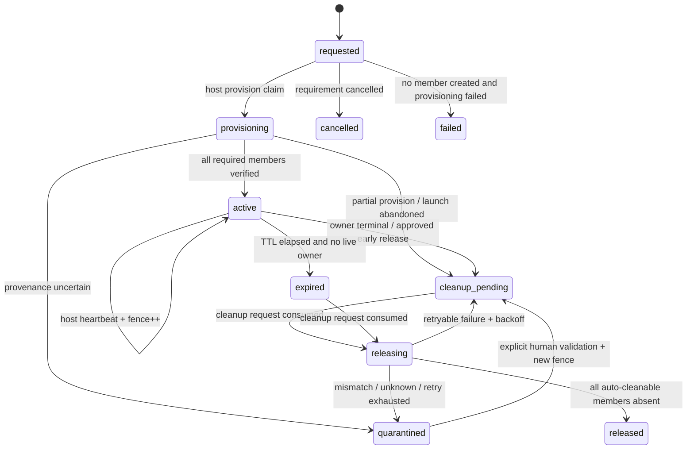

# Runtime resource lease 最終設計

- 状態: **設計レビュー済み・contract 反映待ち**
- 対象タスク: `t_15d5fd6ccfe920b6`
- 対象: hachi-kanban が worktree 実行時に確保する TCP port、Docker/Compose 資源、worktree 専用 PostgreSQL
- 非対象: 本文書による実装、`docs/contract.md` / `packages/core/src/types.ts` の変更、既存 Docker 資源の削除・adopt、volume の自動削除

## 1. 結論

**logical bundle lease + concrete resource member + durable cleanup request** の3層を採用する。
資源名や「接続コンテナが0件」という観測から所有権を推測せず、作成前に lease を durable に確保し、作成後に
Docker object ID・Hachi label・Compose project・実 port を member として確定する。外部の削除 side effect は
host supervisor の `resource-cleanup` stage だけが行う。担当 orchestrator と人間は fenced request を承認・拒否できるが、
raw `docker rm` / `docker network rm` を実行する API は持たない。worker は request/status の参照・作成までで、
renew・承認・cleanup・adopt の権限を持たない。

自動解放は、対象 member ごとに次の全条件が同一 preflight で成立した場合だけ許可する。

```text
managed
AND ephemeral
AND provenance verified
AND unused
AND (owner terminal OR lease expired OR partial provision failed)
AND lease/request/object fencing exact match
AND kind is auto-cleanable
AND cleanup kill-switch is off
AND cleanup budget remains
```

一つでも unknown / false なら自動解放しない。特に `docker_volume`、legacy/unowned、共有 main DB、provenance
不一致、使用中/使用不明、旧 orchestrator generation は自動解放不可である。

worktree PostgreSQL の既定は、user-defined Compose network を新設せず、Docker built-in default bridge と
`127.0.0.1` の Docker-assigned ephemeral host port を使う。built-in bridge 自体は lease の所有物にせず、絶対に
削除しない。main tenant-a PostgreSQL（現状 localhost:5432）への env 切替は fallback にしない。

## 2. 重大な欠落・反対案と採否

### 2.1 現状/素案に対する重大指摘

| 重要度 | 欠落または危険 | 最終判断 |
|---|---|---|
| Critical | 空の Compose network、名前 prefix、古さだけでは所有権を証明できない | DB lease、exact object ID、custom labels の三者一致を必須化する。既存20候補は全件 quarantine |
| Critical | TCP port scan は scan 後から bind まで競合できる | scan を割当手段として禁止。Docker は host port `0`、host-native は `listen(0)` / FD 継承を使う |
| Critical | task/run の終端と Docker 削除は原子的にできない | intent-before-effect の cleanup attempt journal と再 inspect により crash retry を冪等化する |
| Critical | orchestrator session 交代中に旧 generation が削除を承認できる | §55 の stable identity + active session generation + claim token + lease fence を Store CAS で同時検証する |
| Critical | worker が Docker cleanup を行うと two-party gate と sandbox 境界を迂回する | Docker mutator は host supervisor のみに置く。worker prompt、CLI、sandbox の三層で cleanup を禁止する |
| High | `reap` に Docker cleanup を追加すると run/process/resource の異なる証拠と失敗モードが混在する | `resource-reconcile` / `resource-cleanup` を新設し、既存 `reap` は run と process hygiene に限定する |
| High | lease 1行だけでは Compose bundle の container/network/port/volume を個別に判定できない | lease と member を分離し、member ごとに provenance、usage、cleanup policy を持つ |
| High | Docker name は削除後に再利用でき、名前指定 cleanup は別 object を消し得る | engine object ID を必須にし、name は表示用途だけにする。削除直前に ID と labels を再照合する |
| High | TTL だけで resource を消すと supervisor 停止中の長時間 run を破壊し得る | TTL 超過に加えて live task/run が無いことを必須化。heartbeat は worker ではなく host supervisor が更新する |
| High | volume を container/network と同じ扱いにするとデータ損失になる | v1 の volume 自動削除を全面禁止。managed volume でも orchestrator/human path のみ |
| High | main DB の env fallback は worktree 隔離を破る | 既定禁止。明示的 human grant + 専用 DB/schema/role + TTL の例外だけ許可する |
| Medium | backfill が既存 object を managed 扱いすると rollout 自体が削除トリガになる | schema migration と外部 inventory を分離。backfill は unmanaged quarantine observation のみ |

### 2.2 比較した設計案

| 案 | 内容 | 評価 | 採否 |
|---|---|---|---|
| A | JSON/file registry と定期 `docker network ls` 差分 | 導入は軽いが、複数 writer CAS、session fencing、監査、crash recovery を満たさない | 不採用 |
| B | Docker object ごとに lease 1行 | 単純だが Compose bundle の部分成功、endpoint、cleanup 順序を安全に扱えない | 不採用 |
| C | bundle lease + resource members + cleanup request | DDL は増えるが、logical owner、exact object、承認、部分失敗を分離できる | **採用** |
| D | `orchestrator_requests` を cleanup にも流用 | §55 delivery を再利用しやすいが、`answering/waiting_human` と cleanup state が衝突し、CHECK rebuild が必要 | 不採用。identity/session/claim primitive だけ再利用 |
| E | orchestrator CLI が直接 Docker を削除 | 実装は短いが、generation 検証後から side effect までを fence できず、workerとの権限分離も弱い | 不採用 |
| F | 空の legacy network を先に消して address pool を回復 | 現在情報だけでは ownership/provenance を証明できず、本タスクの禁止事項にも反する | 不採用 |

## 3. 現行実装との整合

現行コードから再利用できる性質は次のとおりである。

- `packages/supervisor/src/stages/dispatch.ts` は task `claim_lock` を launch 前に CAS 取得し、launch 後の Tx で
  再検証する。resource requirement/lease もこの claim と同じ fail-closed パターンに接続できる。
- `packages/supervisor/src/stages/reap.ts` は run の current 判定、question lease、dry-run、予算付き process hygiene
  を持つ。ただし Docker object cleanup の ownership 証拠は持たない。
- `packages/core/src/db.ts` の migration v11/v12 と §55 Store API は stable orchestrator identity、単調 generation、
  session heartbeat、CAS claim、handoff/takeover を持つ。cleanup request でも同じ検証 helper を使う。
- `packages/cli/src/commands/doctor.ts` は DB・heartbeat・process hygiene・orchestrator routing を read-only で診断する。
  runtime resource drift の診断先として適切である。
- `packages/supervisor/src/prompt.ts` は live config 変更禁止と process hygiene の恒常 notice を持つ。同じ場所に
  cleanup 権限境界と main DB 禁止を追加する。
- 現行 `resourceGuard` は `maxInFlight` / `maxLaunchesPerTick` / `maxRunSeconds` の run 制御であり、Docker/TCP
  資源の所有権や cleanup budget ではない。既存設定の意味を拡張せず、別 config section を設ける。

## 4. 不変条件と権限境界

### 4.1 MUST invariants

1. DB row だけ、Docker label だけ、Compose name だけでは managed ownership を証明しない。
2. Docker side effect は exact engine object ID に対してのみ行う。name/prefix/glob/prune を削除指定に使わない。
3. worker は lease heartbeat、release、cleanup approve/apply、legacy adopt を行えない。
4. 担当 orchestrator は cleanup decision を fenced request として承認できるが、Docker mutator を直接呼ばない。
5. host supervisor は承認を消費する直前に generation、claim、lease fence、object provenance、usage を再検証する。
6. `docker system prune`、`docker network prune`、`docker volume prune`、`docker compose down -v` は禁止する。
7. user-defined network、built-in `bridge`、既存 volume を共有資源として暗黙 adopt しない。
8. secret（DB password、executor token、claim token）は task body、event payload、label、prompt、notification に保存しない。
9. resource migration/backfill は Docker object を作成・停止・削除・relabel しない。
10. main DB endpoint は、active explicit exception grant がない限り worktree child process へ渡さない。

### 4.2 実行主体

| 主体 | request/status参照 | requirement作成 | heartbeat/renew | cleanup承認 | Docker cleanup side effect |
|---|---:|---:|---:|---:|---:|
| worker | 可 | taskに許可されたkindのみ可 | 不可 | 不可 | 不可 |
| host supervisor | 可 | 自動要求を作成可 | 可 | auto classのみ内部承認 | **可** |
| 担当 orchestrator active generation | 可 | 可 | takeover/rebindのみ | orchestrator class可 | 不可（承認後supervisorが実行） |
| observer/collaborator（primary生存中） | 可 | 不可 | 不可 | 不可 | 不可 |
| human | 可 | 可 | 不可 | human class可 | システム外の緊急運用を除き不可 |

worker sandbox から Docker socket / Docker Desktop API / cleanup executor token を利用できないことを deployment
要件にする。CLI には raw delete/prune command を実装しない。worker が同一OS userであっても、アプリ内 role 名だけを
信用せず、cleanup承認には §55 session claim、human承認には Web write token + request/fence 確認を要求する。

## 5. Resource model

### 5.1 Logical bundle kind

閉じた初期集合を次とする。未知 kind は fail-closed で拒否する。

| bundle kind | 用途 | 既定 network | 既定 cleanup |
|---|---|---|---|
| `worktree_postgres` | host上のworktree/test用 PostgreSQL | Docker built-in `bridge` | container/port auto、volume非auto |
| `worktree_preview` | preview server と付随資源 | host bind または明示managed network | memberごとに判定 |
| `shared_main_db_exception` | 共有PostgreSQL server上の隔離namespaceへの期限付きgrant | 外部 | never |
| `legacy_observation` | rollout前から存在するunowned資源の観測 | 外部 | never/quarantine |

### 5.2 Concrete resource kind

| member kind | identity | usage proof | v1 auto cleanup |
|---|---|---|---:|
| `compose_project` | project name + lease label set | 全member整合 | 直接削除なし（groupingのみ） |
| `docker_container` | Docker context + container ID | live owner/consumer無し、labels一致 | 可 |
| `docker_network` | Docker context + network ID | `Containers` 空、foreign endpoint無し | 可 |
| `docker_volume` | Docker context + volume name/ID | attachment無しでもデータ価値不明 | **不可** |
| `tcp_port` | host identity + bind IP + actual port + owner object ID | active consumer無し、owner mapping一致 | containerと同時releaseのみ |
| `postgres_endpoint` | server fingerprint + database + role | lease consumer無し | 物理削除なし |

`compose_project` と `postgres_endpoint` は論理/接続 member であり、直接 Docker delete を発行しない。
Docker built-in `bridge` は member に登録せず、container provenance の `networkMode` として記録する。

## 6. Ownership と identity

### 6.1 Owner tuple

task resource lease は次を immutable owner tuple として持つ。

```text
(board, taskId, runId?, orchestratorId, repoCommonDir, canonicalWorktree)
```

- `taskId` は必須。`runId` は provision 時点では null でよく、dispatch launch 成功後の同一 Tx で当該 task の
  run ID に一度だけ bind する。
- `orchestratorId` は stable identity。session ID/generation は所有者ではなく mutation authority/fencing である。
- `repoCommonDir` は `git rev-parse --path-format=absolute --git-common-dir` の realpath、worktree は cwd の realpath。
  解決不能時は新規 managed lease を作らない。tenant fallback は legacy routing 表示に限り、ownership key にしない。
- symlink spelling や消滅後の cwd から別 lease に reparent しない。worktree 削除後も確定済み canonical 値を監査用に保持する。
- task explicit binding を正本とし、controller 解決順は §55 と同じ
  `task binding > subtree > exact worktree > project > fallback` とする。
- `observer` は参照のみ。primary が live の間 collaborator は claim できない。

### 6.2 Lease fence

各 lease は正の単調整数 `fence` を持つ。state/owner/expiry を変える CAS と TTL 延長時に `fence = fence + 1` とする。
heartbeat は expiry の残りが renewal interval 以下になった時だけ書き、無用な SQLite write を避ける。cleanup request は
`expected_lease_fence` を snapshot し、承認・execution開始・各member side effect直前の全てで一致を要求する。

orchestrator mutation はさらに次を同時検証する。

```text
session.orchestrator_id = lease.controller_orchestrator_id
AND session.id = :sessionId
AND session.generation = :generation
AND session.status = 'active'
AND request.claim_token_hash = hash(:claimToken)
AND request.claimant_session_id/generation = session.id/generation
AND request.lease_until > now
```

token は平文保存せず hash を保存する。計画 handoff は未実行 claim/approvalを新 generation へ同一 Tx で移管できる。
stale takeover は旧 cleanup claim を移管せず `queued` に戻す。`executing` は host supervisor が既に消費した durable
approvalなので takeover で巻き戻さず、attempt journal から完了/再試行する。

## 7. Lease state machine



### 7.1 Transition rules

- `requested -> provisioning`: host resource stage の requirement claim CAS のみ。
- `provisioning -> active`: required member 全件が actual object inspection と health check に成功した時だけ。
- partial create 後の失敗は `failed` にせず `cleanup_pending` とし、作成済みmemberを失わない。
- `active -> expired`: `expires_at <= now` だけでは不足。task/run が live でなく、question grace/answer lease も無く、
  host heartbeat source が消失したことを Tx 内で再検証する。
- task `done|archived`、run `done|failed|released` は owner terminal 候補だが、同じ lease の別 live consumer が
  0件であることも要求する。
- `quarantined` は自動遷移で cleanup に戻さない。人間が exact object と ownership を検証した新 request が必要。
- `released` は terminal。name/port を再利用する場合も新 lease/member を作る。

## 8. DB schema と index（migration v13案）

`packages/core/src/types.ts` は現在 frozen なので、本タスクでは変更しない。contract 採用後、orchestrator が型面の
変更を解禁・所有する。DDL は既存 v12 の後に additive migration v13 として一つの transaction で適用する。

```sql
CREATE TABLE runtime_resource_requirements (
  id TEXT PRIMARY KEY,
  task_id TEXT NOT NULL REFERENCES tasks(id),
  name TEXT NOT NULL CHECK(length(name) > 0),
  bundle_kind TEXT NOT NULL CHECK(bundle_kind IN (
    'worktree_postgres', 'worktree_preview', 'shared_main_db_exception'
  )),
  spec TEXT NOT NULL DEFAULT '{}',
  status TEXT NOT NULL CHECK(status IN (
    'pending', 'provisioning', 'ready', 'failed', 'cancelled'
  )),
  lease_id TEXT NOT NULL DEFAULT '',
  idempotency_key TEXT NOT NULL UNIQUE,
  created_at INTEGER NOT NULL,
  updated_at INTEGER NOT NULL,
  UNIQUE(task_id, name)
);
CREATE INDEX idx_runtime_requirements_dispatch
  ON runtime_resource_requirements(status, updated_at, task_id);

CREATE TABLE runtime_resource_leases (
  id TEXT PRIMARY KEY,
  bundle_kind TEXT NOT NULL CHECK(bundle_kind IN (
    'worktree_postgres', 'worktree_preview', 'shared_main_db_exception', 'legacy_observation'
  )),
  state TEXT NOT NULL CHECK(state IN (
    'requested', 'provisioning', 'active', 'cleanup_pending', 'expired',
    'releasing', 'released', 'quarantined', 'failed', 'cancelled'
  )),
  cleanup_policy TEXT NOT NULL CHECK(cleanup_policy IN ('auto', 'orchestrator', 'human', 'never')),
  managed INTEGER NOT NULL CHECK(managed IN (0, 1)),
  ephemeral INTEGER NOT NULL CHECK(ephemeral IN (0, 1)),
  owner_task_id TEXT REFERENCES tasks(id),
  owner_run_id INTEGER REFERENCES task_runs(id),
  controller_orchestrator_id TEXT REFERENCES orchestrators(id),
  board TEXT NOT NULL,
  project TEXT NOT NULL DEFAULT '',
  repo_common_dir TEXT NOT NULL DEFAULT '',
  canonical_worktree TEXT NOT NULL DEFAULT '',
  fence INTEGER NOT NULL CHECK(fence > 0),
  heartbeat_at INTEGER,
  expires_at INTEGER,
  terminal_reason TEXT NOT NULL DEFAULT '',
  provenance_version INTEGER NOT NULL DEFAULT 0,
  rollout_generation INTEGER NOT NULL DEFAULT 0,
  created_at INTEGER NOT NULL,
  updated_at INTEGER NOT NULL,
  released_at INTEGER
);
CREATE INDEX idx_runtime_leases_reconcile
  ON runtime_resource_leases(state, expires_at, updated_at, id);
CREATE INDEX idx_runtime_leases_owner
  ON runtime_resource_leases(owner_task_id, owner_run_id, state);
CREATE INDEX idx_runtime_leases_controller
  ON runtime_resource_leases(controller_orchestrator_id, state, updated_at);

CREATE TABLE runtime_resource_members (
  id TEXT PRIMARY KEY,
  lease_id TEXT NOT NULL REFERENCES runtime_resource_leases(id),
  kind TEXT NOT NULL CHECK(kind IN (
    'compose_project', 'docker_container', 'docker_network', 'docker_volume',
    'tcp_port', 'postgres_endpoint'
  )),
  state TEXT NOT NULL CHECK(state IN ('observed', 'active', 'releasing', 'released', 'quarantined')),
  cleanup_policy TEXT NOT NULL CHECK(cleanup_policy IN ('auto', 'orchestrator', 'human', 'never')),
  managed INTEGER NOT NULL CHECK(managed IN (0, 1)),
  ephemeral INTEGER NOT NULL CHECK(ephemeral IN (0, 1)),
  object_fence INTEGER NOT NULL CHECK(object_fence > 0),
  scope_key TEXT NOT NULL,
  native_id TEXT NOT NULL DEFAULT '',
  display_name TEXT NOT NULL DEFAULT '',
  host_ip TEXT NOT NULL DEFAULT '',
  host_port INTEGER,
  container_port INTEGER,
  compose_project TEXT NOT NULL DEFAULT '',
  labels_hash TEXT NOT NULL DEFAULT '',
  provenance TEXT NOT NULL DEFAULT '{}',
  provenance_verified_at INTEGER,
  last_observed_at INTEGER NOT NULL,
  released_at INTEGER,
  created_at INTEGER NOT NULL,
  updated_at INTEGER NOT NULL,
  UNIQUE(lease_id, kind, native_id)
);
CREATE UNIQUE INDEX idx_runtime_member_live_native
  ON runtime_resource_members(scope_key, kind, native_id)
  WHERE native_id <> '' AND state IN ('active', 'releasing', 'quarantined');
CREATE UNIQUE INDEX idx_runtime_member_live_tcp
  ON runtime_resource_members(scope_key, host_ip, host_port)
  WHERE kind = 'tcp_port' AND host_port IS NOT NULL AND state IN ('active', 'releasing');
CREATE INDEX idx_runtime_members_cleanup
  ON runtime_resource_members(lease_id, state, cleanup_policy, kind);

CREATE TABLE runtime_cleanup_requests (
  id TEXT PRIMARY KEY,
  lease_id TEXT NOT NULL REFERENCES runtime_resource_leases(id),
  decision_class TEXT NOT NULL CHECK(decision_class IN ('auto', 'orchestrator', 'human')),
  reason TEXT NOT NULL CHECK(length(reason) > 0),
  status TEXT NOT NULL CHECK(status IN (
    'queued', 'delivered', 'claimed', 'waiting_human', 'approved',
    'executing', 'retry_wait', 'succeeded', 'rejected', 'quarantined', 'cancelled'
  )),
  expected_lease_fence INTEGER NOT NULL CHECK(expected_lease_fence > 0),
  expected_members_hash TEXT NOT NULL,
  claimant_session_id TEXT NOT NULL DEFAULT '',
  claimant_generation INTEGER,
  claim_token_hash TEXT NOT NULL DEFAULT '',
  claim_lease_until INTEGER,
  approved_by TEXT NOT NULL DEFAULT '',
  approval_generation INTEGER,
  executor_id TEXT NOT NULL DEFAULT '',
  executor_generation INTEGER NOT NULL DEFAULT 0,
  executor_lease_until INTEGER,
  execution_nonce TEXT NOT NULL DEFAULT '',
  attempts INTEGER NOT NULL DEFAULT 0,
  next_attempt_at INTEGER NOT NULL DEFAULT 0,
  last_error TEXT NOT NULL DEFAULT '',
  created_at INTEGER NOT NULL,
  updated_at INTEGER NOT NULL,
  resolved_at INTEGER,
  UNIQUE(lease_id, expected_lease_fence, reason)
);
CREATE INDEX idx_runtime_cleanup_due
  ON runtime_cleanup_requests(status, next_attempt_at, created_at, id);
CREATE INDEX idx_runtime_cleanup_claim
  ON runtime_cleanup_requests(claimant_session_id, claimant_generation, status);

CREATE TABLE runtime_cleanup_deliveries (
  id INTEGER PRIMARY KEY AUTOINCREMENT,
  request_id TEXT NOT NULL REFERENCES runtime_cleanup_requests(id),
  orchestrator_id TEXT NOT NULL REFERENCES orchestrators(id),
  watch_id TEXT REFERENCES orchestrator_watches(id),
  status TEXT NOT NULL CHECK(status IN ('pending', 'delivered', 'acknowledged', 'dismissed')),
  created_at INTEGER NOT NULL,
  updated_at INTEGER NOT NULL,
  UNIQUE(request_id, orchestrator_id)
);
CREATE INDEX idx_runtime_cleanup_delivery_target
  ON runtime_cleanup_deliveries(orchestrator_id, status, created_at, id);

CREATE TABLE runtime_cleanup_attempts (
  id INTEGER PRIMARY KEY AUTOINCREMENT,
  request_id TEXT NOT NULL REFERENCES runtime_cleanup_requests(id),
  execution_nonce TEXT NOT NULL UNIQUE,
  executor_id TEXT NOT NULL,
  executor_generation INTEGER NOT NULL CHECK(executor_generation > 0),
  expected_lease_fence INTEGER NOT NULL,
  expected_members_hash TEXT NOT NULL,
  state TEXT NOT NULL CHECK(state IN ('intent', 'effect_started', 'verified', 'failed')),
  result TEXT NOT NULL DEFAULT '{}',
  started_at INTEGER NOT NULL,
  updated_at INTEGER NOT NULL,
  completed_at INTEGER
);
CREATE INDEX idx_runtime_cleanup_attempt_open
  ON runtime_cleanup_attempts(state, updated_at, id);

CREATE TABLE runtime_resource_events (
  id INTEGER PRIMARY KEY AUTOINCREMENT,
  lease_id TEXT NOT NULL REFERENCES runtime_resource_leases(id),
  request_id TEXT REFERENCES runtime_cleanup_requests(id),
  event_type TEXT NOT NULL,
  actor TEXT NOT NULL DEFAULT '',
  payload TEXT NOT NULL DEFAULT '{}',
  idempotency_key TEXT NOT NULL DEFAULT '',
  created_at INTEGER NOT NULL
);
CREATE UNIQUE INDEX idx_runtime_events_idem
  ON runtime_resource_events(idempotency_key)
  WHERE idempotency_key <> '';
CREATE INDEX idx_runtime_events_lease
  ON runtime_resource_events(lease_id, created_at DESC, id DESC);

CREATE TABLE runtime_resource_outbox (
  id INTEGER PRIMARY KEY AUTOINCREMENT,
  lease_id TEXT NOT NULL REFERENCES runtime_resource_leases(id),
  request_id TEXT REFERENCES runtime_cleanup_requests(id),
  dedupe_key TEXT NOT NULL UNIQUE,
  kind TEXT NOT NULL CHECK(kind IN (
    'cleanup_decision', 'cleanup_quarantined', 'cleanup_exhausted',
    'cleanup_budget_saturated', 'shared_db_exception', 'inventory_summary'
  )),
  payload TEXT NOT NULL DEFAULT '{}',
  sent_transports TEXT NOT NULL DEFAULT '[]',
  status TEXT NOT NULL CHECK(status IN ('pending', 'sent', 'failed')),
  attempts INTEGER NOT NULL DEFAULT 0,
  next_attempt_at INTEGER NOT NULL DEFAULT 0,
  created_at INTEGER NOT NULL,
  updated_at INTEGER NOT NULL
);
CREATE INDEX idx_runtime_resource_outbox_due
  ON runtime_resource_outbox(status, next_attempt_at, id);

CREATE TABLE runtime_resource_exceptions (
  id TEXT PRIMARY KEY,
  lease_id TEXT NOT NULL REFERENCES runtime_resource_leases(id),
  kind TEXT NOT NULL CHECK(kind = 'shared_main_db'),
  access_mode TEXT NOT NULL CHECK(access_mode IN ('read_only', 'isolated_write')),
  server_fingerprint TEXT NOT NULL,
  database_name TEXT NOT NULL,
  schema_name TEXT NOT NULL,
  role_name TEXT NOT NULL,
  approved_by TEXT NOT NULL,
  approval_reason TEXT NOT NULL,
  expires_at INTEGER NOT NULL,
  revoked_at INTEGER,
  created_at INTEGER NOT NULL,
  updated_at INTEGER NOT NULL
);
CREATE INDEX idx_runtime_exceptions_active
  ON runtime_resource_exceptions(lease_id, expires_at, revoked_at);
```

`runtime_resource_requirements.lease_id` は SQLite の循環 DDL/段階作成を単純にするため v13 では text reference とし、
Store が存在・task一致を Tx 検証する。将来 table rebuild 時に FK を追加してよい。`spec` / `provenance` / event payload は
zod で kind 別 schema を検証し、unknown key/unknown version は cleanup eligibility を false にする。

### 8.1 DBに保存しないもの

- PostgreSQL password、Docker credential、Web/executor token、orchestrator claim token平文
- cleanup shell command文字列
- secret入り `DATABASE_URL`

connection secret は `$HACHI_KANBAN_HOME/runtime-secrets/<leaseId>/` に0600で保存し、lease release後に host supervisor
が exact path containment を検証して削除する。secret file deletion は Docker cleanup と別 action で、失敗しても資源を
誤削除しない。artifact/promptにはsecret値を出さない。

## 9. Provision と dispatch の接続

### 9.1 Requirement-first flow

1. task作成時または担当orchestratorが idempotent requirement を登録する。
2. `resource-reconcile` が `pending` requirement を CAS claimし、leaseを `requested -> provisioning` にする。
3. host provisioner が外部資源を作成する。各 side effect 後、actual object ID/labels/port をmemberへ即時記録する。
4. required member 全件の inspect + health check 後だけ lease/requirement を `active/ready` にする。
5. dispatch は requirement が `ready` でない task を **claimせず skip** する。failed/quarantined は
   `user-decision:` または `needs-manual:` へ fail-closed block する。
6. dispatch が task claim を取得した後、lease state/fence/task/worktree を再検証して endpoint metadata を launch に渡す。
7. launch後の `startRun + task transition` Tx で `owner_run_id` をbindし、lease fenceを更新する。
8. launch失敗またはpost-launch task claim不一致時、作成済みleaseを黙って残さず `cleanup_pending` requestを作る。

resource bound task の launch option は将来 `resourceBindings` / explicit environment を持たせる。G2 bridge API §4 は変更不可
なので、bridgeへsecret envを追加送信しない。非secret endpoint とsecret file pathだけをpromptで案内するか、resource-bound
profileをdirect transportに限定する。初期実装は **direct限定** を推奨する。bridge対応はsecretをprompt/artifactへ出さずに
session-scoped envを渡せる別契約ができるまで有効化しない。

### 9.2 Worktree PostgreSQL profile

- user-defined Compose network は作らず `network_mode: bridge` 相当を使う。
- container は custom Hachi labels を付け、host mapping は `127.0.0.1` の ephemeral port とする。
- built-in bridge は外部共有資源であり `managed=false/cleanup_policy=never`。削除・disconnect・relabelしない。
- データが真に使い捨てなら container writable layer または tmpfs を使う。named volume が必要なら member を記録するが、
  v1では自動削除しない。
- server ready は単なる TCP connect でなく、container health + PostgreSQL identity（期待database/user）で確認する。
- endpoint確定後、host=127.0.0.1、actual port、container ID、server fingerprintを同じlease fence世代に記録する。

## 10. TCP port TOCTOU の解消

### 10.1 Docker PostgreSQL

port scan は行わない。Dockerへ `127.0.0.1::5432`（またはAPI上の published port 0）を要求し、container start後に
Docker inspect/Compose port APIから actual mappingを取得する。

受理条件は全て満たすこと。

1. inspect対象 container ID が作成時に記録したIDと一致する。
2. `5432/tcp` のmappingがちょうど1つである。
3. `HostIp` が `127.0.0.1`。`0.0.0.0`、空、予期しないIPv6 wildcardは拒否する。
4. `HostPort` が1..65535の整数。
5. labelsの lease ID/object fence/task/project がDB snapshotと一致する。
6. actual endpointへのhealth/identity probeが成功する。

container restartでDockerが別portを割り当てた場合、旧 endpoint を使い続けない。leaseを一旦 provisioning 相当に戻し、
member/fenceを更新してhealth確認後に再公開する。live runが旧endpointを使用中なら自動更新せずblock/再起動判断へ送る。

### 10.2 Host-native service

- 最善: process自身が `127.0.0.1:0` を `listen()` し、`server.address().port` を報告する。
- 次善: supervisorが `SO_REUSEPORT` 無しでreservation socketをbindし、FDをchildへ継承して同じsocketをlistenさせる。
- FD継承不能な既存 tenant-a launcher は port scan を「候補のhint」に格下げし、bind失敗を認識してbounded retryする。
  scan結果をlease activeの証拠にしない。actual listener PID/start-time/health probeを記録してからactiveにする。
- 3190/8977/5432を含む既存listenerは unmanaged observation。停止、横取り、lease adoptを行わない。

DBの `tcp_port` UNIQUE index はHachi内部の重複を防ぐだけで、kernel bindの代替ではない。

## 11. Docker/Compose provenance

### 11.1 Required labels

Hachiが新規作成する container/network/volume には次を付ける。Docker標準Compose labelsも保持する。

```text
io.hachi.managed=true
io.hachi.ephemeral=true|false
io.hachi.provenance-version=1
io.hachi.lease-id=<leaseId>
io.hachi.object-fence=<member.object_fence-at-create>
io.hachi.board=<board>
io.hachi.task-id=<taskId>
io.hachi.run-id=<runId-or-empty>
io.hachi.orchestrator-id=<stableIdentityId>
io.hachi.repo-common-dir-hash=<sha256>
io.hachi.worktree-hash=<sha256>
io.hachi.bundle-kind=<kind>
io.hachi.rollout-generation=<generation>
```

raw filesystem path、token、passwordはlabelに置かない。Composeを使う場合は project name を
`hachi_<shortLeaseId>` のようにlease IDから決定し、`com.docker.compose.project` / service / oneoffとの一致も検証する。

### 11.2 Provenance verified

`provenance_verified` は次の conjunction であり、name prefixだけでは成立しない。

- DB memberの `managed=1`, `provenance_version>=1`, `rollout_generation>=autoCleanupRolloutGeneration`
- memberのDocker context (`scope_key`) が現在のallowlisted contextと一致
- inspectしたobject IDが `native_id` と一致
- required custom labelsの値とDB lease/member snapshotが一致する。immutableな`object-fence`はmember列と比較し、
  heartbeatで進むcurrent lease fenceとは比較しない
- Compose objectならstandard Compose project/service labelも期待値と一致
- create後に記録したlabels canonical hashが一致
- memberがquarantinedでない

objectがnot foundなら、既存 `runtime_cleanup_attempts` のintentがあるcleanup retryに限り「既に削除済み」として成功扱いできる。
通常inventoryでnot foundを見つけた場合はdrift eventを記録し、勝手にreleasedへしない。

## 12. Cleanup eligibility と判定表

### 12.1 Auto predicate

auto cleanup開始時と各member side effect直前に、次をfresh DB Tx + fresh Docker inspectで評価する。

| 条件 | 合格条件 |
|---|---|
| managed | lease と member の両方が true |
| ephemeral | lease と member の両方が true |
| provenance | §11.2 全項目 true |
| unused | live task/run/requirement/consumer 0。networkはforeign endpoint 0。unknownはfalse |
| terminal/expired | terminal_reason が `owner_terminal|lease_expired|provision_failed` のいずれか |
| lease fence | lease.fence = request.expected_lease_fence |
| member fence | expected_members_hash = fresh canonical member snapshot hash |
| session fence | orchestrator classなら active session/generation/claim一致。autoはhost executor claim一致 |
| kind | container/network/tcpだけ。volume/compose_project/postgres_endpointは直接auto deleteしない |
| controls | mode=enforce、kill-switch無、budget内、backoff期限到来 |

`explicit_release` はowner terminal/expiredではないためauto pathに入れず、少なくともorchestrator approvalを要求する。

### 12.2 自動削除・orchestrator claim・human approval 判定表

| 状況 | 自動解放 | orchestrator claim | human approval | 結果 |
|---|---:|---:|---:|---|
| 新規managed+ephemeral container、provenance一致、unused、owner terminal、fence一致 | 可 | 不要 | 不要 | supervisorがbudget内でexact IDをremove |
| 上記に属するmanaged network、`Containers={}`、foreign endpoint無し | 可 | 不要 | 不要 | container後にexact network IDをremove |
| Docker-assigned tcp mapping、owner containerの正常remove確認済み | 可 | 不要 | 不要 | mapping memberをreleased化（任意listener killはしない） |
| active ownerからの早期停止、全証拠一致 | 不可 | **必須** | 不要 | primary承認後supervisor実行 |
| cleanup policy=`orchestrator`、全証拠一致 | 不可 | **必須** | 不要 | fenced request |
| managed volume（未接続を含む） | **不可** | 必須 | 原則**必須** | v1はpreserve。別の明示手順のみ |
| legacy/unowned、custom label無し | **不可** | 不可（adopt前） | 削除するなら**必須** | quarantine。v1 cleanup対象外 |
| provenance/label/object ID不一致 | **不可** | 不可 | 調査・再同定に**必須** | quarantine |
| networkにforeign container接続 | **不可** | 不可 | 解除方針に**必須** | quarantine/通知 |
| usageが取得不能、Docker API不達 | **不可** | 不可 | 不要（復旧待ち） | retry/backoff、削除なし |
| task/run live または question grace 中 | **不可** | 早期停止なら必須 | policy次第 | 通常はlease renew |
| stale orchestrator generation/claim期限切れ | **不可** | 再claim必須 | 不要 | mutation拒否 |
| shared main DB / built-in bridge /外部endpoint | **不可** | 不可 | grant/revokeのみ | physical deleteなし |
| kill-switch ON / observe mode / budget枯渇 | **不可** | request保持 | request保持 | 次tick以降へ延期 |

## 13. Durable cleanup routing と external effect

### 13.1 Request routing

cleanup request作成と対象identityごとのdelivery作成は同一Txで行う。resolverは§55と同じ canonical worktree/
repo common-dir/binding規則を共有するが、worker question table/statusは流用しない。

- `auto`: delivery不要。host executorがdue requestをCAS claimする。
- `orchestrator`: primaryへdelivery。primary不在/stale/release後のみcollaborator、最後にfallback。
- `human`: `waiting_human` とdurable notification outboxを作る。orchestratorは説明/escalateできるが自己承認不可。
- delivery済みを対応中と表示せず、claim成功をacknowledgeとする。
- requestは `(leaseId, expectedFence, reason)` で冪等。
- `orchestrator await` はworker questionとcleanup requestをtagged unionで返してよいが、answerとapprove APIは分離する。

### 13.2 Approval と execution

1. orchestrator/humanがexpected fenceとmember planを見てapproveする。Storeがsession/claim/fenceをCAS検証する。
2. host supervisorが`approved|queued(auto)|retry_wait(due)`を取り、fresh eligibilityを評価する。
3. 同一Txで request=`executing`、lease=`releasing`、host process固有のexecutor ID、単調execution generation、
   executor lease、unique execution nonceのattempt=`intent`を記録する。別supervisorはexecutor lease期限内に横取りしない。
4. **外部effect直前**にkill-switch、lease fence、request nonce、member hash、Docker inspectを再確認する。
5. container -> network の順にexact IDへbounded removeを行う。volume delete commandは生成しない。
6. 各effect後にsame IDがnot foundであることを確認し、attempt resultへ記録する。
7. 全auto-cleanable memberがreleasedならlease/requestをreleased/succeededにする。preserved volumeがあればlease自体は
   `quarantined` または「released with retained members」にせず、`quarantined` + 明示noteとする。論理的完了を表すため
   v1は volumeを持つleaseのcleanup policyを最初からhumanにし、auto requestを作らない。

crashが3と4の間ならexecutor lease期限切れ後にCAS takeoverし、execution generationを進めてintentを再評価する。
effect後/DB commit前ならexact ID not found + 同じintent nonceを根拠にverifiedへ進める。旧executorが遅れて再開しても、
side effect直前のgeneration再検証で拒否する。検証直後の停止という避けられないwindowでもexact object IDへの同一removeしか
行わないため冪等であり、別IDが同名で存在しても削除しない。

### 13.3 Session handoff/takeover

- handoff prepare後、旧sessionは新 cleanup claim/approve不可。
- handoff acceptは `claimed` requestを新generationへ移管可能だが、member plan/fenceは変更しない。
- stale takeoverは旧claim/approvalをqueuedへ戻す。旧generationのapprove/rejectはStoreで拒否。
- hostが既に`executing`へ消費したrequestは移管しない。以後はexecution nonceとlease fenceがauthorityである。

## 14. Cleanup budget、kill-switch、dry-run、backoff

### 14.1 Config（欠如時はobserve-only）

```json
{
  "runtimeResources": {
    "mode": "observe",
    "provisioningEnabled": false,
    "leaseTtlSeconds": 300,
    "heartbeatIntervalSeconds": 60,
    "provisioningTimeoutSeconds": 300,
    "cleanup": {
      "maxRequestsPerTick": 2,
      "maxContainerRemovalsPerTick": 2,
      "maxNetworkRemovalsPerTick": 1,
      "maxWallSecondsPerTick": 15,
      "baseBackoffSeconds": 60,
      "maxBackoffSeconds": 3600,
      "maxAttempts": 5,
      "autoCleanupRolloutGeneration": 1
    }
  }
}
```

値はzod strict schemaで正の上限付き整数として検証する。既存 live `config.json` はmigration/workerが書き換えない。
section欠如は `mode=observe`, `provisioningEnabled=false` と解釈し、inventory/planだけを行う。

### 14.2 Controls

- stage kill-switch: `$HACHI_KANBAN_HOME/resource-reconcile.disabled` と `resource-cleanup.disabled`。
- `supervisor.disabled` は両方を包含する。
- stage開始時だけでなく各external side effect直前にcleanup switchを確認する。
- `--apply`無しはplan/event noteのみ。Docker create/stop/remove/relabelをしない。
- wall budget到達時は現在のobject action完了後に止め、残requestをdueのまま残す。
- retryable errorは指数backoff + deterministic jitter。`in use`、Docker不達、timeoutはretry対象。
- label/ID/fence mismatch、unknown kind、parse error、maxAttempts超過はretry loopにせずquarantine。
- prune禁止はconfigで解除できない。

## 15. Legacy quarantine と現在32 network/20候補の移行

この rollout では **削除を一件も実行しない**。手順を固定する。

1. v13 schemaを適用する。migrationはDocker socketへ接続しない。
2. config section欠如のままobserve modeで起動する。cleanup/provision stageはexternal mutationをしない。
3. read-only inventoryで現在の32 networkをobject ID付きで観測する。
4. custom Hachi provenance labelsを完全に持たないnetworkは、接続containerが0件でも
   `legacy_observation / managed=0 / ephemeral=0 / cleanup_policy=never / state=quarantined` として記録する。
5. 20候補を一括adopt/relabelせず、cleanup requestも自動作成しない。Web/doctorには「candidate」ではなく
   「unowned quarantine」と表示する。
6. localhost:3190/8977/5432はlive external TCP observationとして記録できるが、lease/adopt/stopしない。
7. 新規 worktree PostgreSQL はbuilt-in bridge + ephemeral port方式を別途明示enable後に作る。16枠のuser-defined
   address poolを消費しない。
8. auto cleanupを有効化する場合も、rollout watermark以降に本システムが作成し、provenance v1を持つmemberだけを対象にする。

legacy objectを将来削除するには、本設計外の human-runbook で用途、owner、backup、Docker contextを確認する。単に
`Containers={}` であることは承認根拠にならない。volumeはそのrunbookでも別確認とする。

## 16. Shared main DB 禁止と明示例外

### 16.1 Default deny

- worktreeの `DATABASE_URL`, `PGHOST`, `PGPORT` を main tenant-a PostgreSQL（現状127.0.0.1:5432）へ自動切替しない。
- subnet/port/provisioning失敗時のfallbackにmain DBを使わない。
- task bodyやrepo `.env` にmain DB URLを書いて許可扱いしない。
- `worktree-preview.sh` は専用DB失敗時、built-in bridgeの専用containerを試す。これも失敗したら明示エラーで停止する。

### 16.2 Explicit exception grant

例外はhuman approvalのみで、次を全て満たす期限付き `shared_main_db_exception` lease として記録する。

1. server fingerprint、専用database、専用schema、専用roleが固定される。
2. main tenant-a database/public schemaと異なるnamespaceで、roleの`search_path`と権限がそのnamespaceに限定される。
3. 既定はread-only。writeは`isolated_write`として別承認し、migration/drop/truncateのscopeを限定する。
4. task/run/canonical worktreeへbindし、短いexpires_atとrevoke pathを持つ。
5. child processだけにscoped envを渡し、repo/global shell/live configへ永続化しない。
6. endpoint/credentialをevent、label、prompt、notificationへ出さない。
7. doctorはexpired grant、namespace/role fingerprint drift、main database名との一致をNGにする。
8. exception leaseのcleanup_policyは`never`。物理server/containerを削除せず、grant revokeだけを扱う。

専用database/schema/roleを作れない場合は例外を許可しない。「同じmain databaseをテスト後rollback」は隔離とみなさない。

## 17. CLI / Web / doctor / event / notification API

### 17.1 CLI

読み取り:

```text
hachi resource list [--task <id>] [--state <state>] [--json]
hachi resource show <leaseId> [--events <n>] [--json]
hachi resource plan-cleanup [<leaseId>] [--json]
hachi resource inventory [--docker] [--json]
```

要求/判断:

```text
hachi resource request --task <id> --name <name> --kind <bundleKind> --spec <json>
hachi resource cleanup claim <requestId> --session <id> --generation <n> --json
hachi resource cleanup approve <requestId> --session <id> --generation <n> --claim <token>
hachi resource cleanup reject <requestId> --session <id> --generation <n> --claim <token> --reason <text>
hachi resource cleanup release <requestId> --session <id> --generation <n> --claim <token>
```

worker-facing CLIはrequest/statusに限定する。`cleanup apply/delete/prune/adopt` は公開CLIに置かない。human quarantine
validationは専用runbook/将来admin commandとし、必ずexact IDとfenceを再入力させる。

### 17.2 Web

- `GET /api/runtime-resources`、`GET /api/runtime-resources/:id`、`GET /api/runtime-cleanup-requests/:id`
- task詳細にrequirement、lease、actual nonsecret endpoint、controller、fence、expiry、member、cleanup eligibilityを表示する。
- eligibilityは単一booleanだけでなく、managed/ephemeral/provenance/unused/terminal/fence/kind/controlの各証拠を表示する。
- human approvalは既存write token、same-origin、確認dialog、request ID + expected fenceの一致を必須にする。
- generic Docker delete APIは作らない。
- supervisor panelのallowlistへ `resource-reconcile` / `resource-cleanup` を追加する。

### 17.3 Doctor

read-only検査を追加する。

- runtime resource config schema/mode/kill-switch
- Docker context identity、API到達性（`--offline`では外形probeのみskip）
- user-defined address pool使用状況と枯渇警告（修復・削除はしない）
- active leaseのexpiry/heartbeat、live task/runとの矛盾
- DB memberとactual object ID/labels/Compose projectのdrift
- orphan managed-label object（DB row無し）とunowned quarantine件数
- cleanup queue、stale claim/generation、retry/backoff、budget saturation
- unexpected wildcard host port、duplicate endpoint、既知main endpointへの未承認worktree接続
- expired/shared DB exception、namespace fingerprint drift
- retained volume件数をwarn（NGにするかはpolicy）

### 17.4 Events と notifications

主要event:

```text
resource_requirement_created
resource_lease_requested
resource_provision_started
resource_member_observed
resource_lease_activated
resource_lease_expired
resource_provenance_mismatch
resource_cleanup_requested
resource_cleanup_delivered
resource_cleanup_claimed
resource_cleanup_approved
resource_cleanup_execution_started
resource_member_released
resource_cleanup_retry_scheduled
resource_cleanup_quarantined
resource_lease_released
shared_db_exception_granted
shared_db_exception_revoked
```

heartbeatごとのeventは作らずrow update + metricsにする。task ownerがあるstate changeはresource eventに加えて、task eventへ
lease/request IDだけをsummary記録する。

notificationはdurable outboxを使い、dedupe keyを
`(cleanupRequestId, expectedFence, notificationKind, transport)` とする。通常auto成功は通知せず、次を通知する。

- orchestrator/human判断待ち
- quarantine/provenance mismatch
- maxAttempts超過、budget長期飽和
- shared main DB grant/expiry/revoke
- observe inventoryの集計（32/20を1件ずつ通知しない）

## 18. File / section 単位の実装差分

本タスクでは以下を変更しない。contract採用後の実装単位を示す。

| 対象 | 現状 | 必要差分 |
|---|---|---|
| `docs/contract.md` §5 | migration v1基本DDL + 後続追補 | v13 tables/index、secret非保存、migration/backfill境界を追加 |
| `docs/contract.md` §10 | run中心のstage順 | `scheduler → resource-reconcile → dispatch → ... → reap → resource-cleanup → notify`、独立kill-switch/budgetを追加 |
| `docs/contract.md` §23 | stage kill-switch allowlist | `resource-reconcile` / `resource-cleanup` を追加 |
| `docs/contract.md` §33 | doctor外形監視 | §17.3のruntime resource検査を追加 |
| `docs/contract.md` §51 | reap/process hygiene | Docker runtime resource cleanupをreapに入れない境界を明記 |
| `docs/contract.md` §55 | worker question routing | identity/session/watch/binding/claim helperのcleanup再利用、table/state分離を追加 |
| `docs/contract.md` 新§56案 | 無し | 本文書§22の規範文を追加 |
| `packages/core/src/types.ts` | frozen共有契約 | **orchestrator管理でのみ** requirement/lease/member/cleanup型とStore APIを追加 |
| `packages/core/src/db.ts` | migration v12、§55 CAS | v13、lease/member CAS、cleanup claim/approval/attempt journal、resolver共通化 |
| `packages/core/src/config-schema.ts` | `resourceGuard`はrun予算 | 独立`runtimeResources` strict schemaを追加。既存resourceGuardの意味は変えない |
| `packages/supervisor/src/stages/dispatch.ts` | task claim→launch→run Tx | requirement gate、lease/fence再検証、resource binding注入、run bind、launch失敗cleanup request |
| `packages/supervisor/src/stages/reap.ts` | orphan run/released、process hygiene | leaseを直接削除しない。run terminal signalはStore state/eventだけ。Docker logicを追加しない |
| `packages/supervisor/src/stages/orchestrator-routing.ts` | worker question backfill/stale session | cleanup delivery/claim expiryを同じsession stale処理へ接続。legacy Docker backfillはしない |
| `packages/supervisor/src/prompt.ts` | config/process notice | cleanup禁止、main DB default deny、assigned lease/endpointの非secret案内を追加 |
| `packages/cli/src/commands/doctor.ts` | DB/bridge/process/§55診断 | §17.3のread-only診断を追加 |
| `packages/cli/src/commands/resource.ts` | 無し | §17.1のporcelain。raw delete無し |
| `packages/supervisor/src/stages/resource-reconcile.ts` | 無し | requirement claim、provision、heartbeat/expiry、inventory drift |
| `packages/supervisor/src/stages/resource-cleanup.ts` | 無し | durable request消費、fresh preflight、attempt journal、exact-ID cleanup |
| `packages/web/src/app.ts` / shared API types / client | runtime資源面無し | read APIs、task detail、human approval、kill-switch status |
| `packages/web/src/supervisor-status.ts` | stage allowlist固定 | 新stage名と表示順を追加 |
| tenant-a port allocator（外部repo） | scan後bindでTOCTOU | `listen(0)`/FD継承、不能ならbind失敗bounded retry + actual listener記録 |
| `worktree-preview.sh`（外部repo） | 専用Postgresのdefault bridge fallback | default bridge + Docker ephemeral portを既定化し、actual inspect値を利用。main DB fallbackを拒否 |

## 19. Migration、backfill、rollout、rollback

### 19.1 Rollout

1. contract §56と型変更権限をorchestratorが確定する。
2. v13 additive migration + Store unit testsを導入する。modeはobserve既定。
3. read-only inventory/doctor/Webだけを導入する。32 network/20 quarantine、3190/8977/5432無変更を検証する。
4. provisionerをdry-runで導入し、Docker test doubleで検証する。
5. worktree PostgreSQLの新規leaseだけを明示configでenableする。cleanupはまだobserve。
6. cleanup planとactual object evidenceを一定期間比較する。
7. rollout generation watermarkを設定し、新規managed container/networkだけauto cleanupをenableする。
8. volume、legacy、main DB exceptionはauto対象外のまま維持する。

### 19.2 Backfill

- DB migration内でDocker inventoryをしない。
- application backfillはread-onlyで、object IDをkeyに冪等upsertする。
- 完全なHachi label setの無い既存objectは `managed=0/ephemeral=0/quarantined/never`。
- custom labelが一部だけあるobjectは「adopt候補」にせずprovenance mismatch quarantine。
- rollout前objectを後から自動cleanup対象へ昇格しない。adoptは本設計外のhuman ceremony。

### 19.3 Rollback

- 最初に `resource-reconcile.disabled` と `resource-cleanup.disabled` を作る。live config書換は不要。
- code rollbackはv13 tables/labelsを残し、旧binaryに無視させる。down migration/dropは行わない。
- provisioning途中のobjectは削除せず、inventory/runbookへ引き継ぐ。
- secret filesはcontainment確認済みの専用recovery toolでのみ回収する。
- rollbackを理由にDocker network/volume pruneを行わない。

## 20. Test matrix

テストはDocker実機/networkへ触れず、inspect/create/remove/listen/clock/processをDIしたfakeで行う。別途明示的なlocal
smokeだけをrunbookに置く。

| 分類 | 必須ケース |
|---|---|
| migration | new DB v1..v13、v12 upgrade、再実行、途中rollback、CHECK/index/partial UNIQUE、external call 0 |
| requirement | idempotency、同名競合、pendingはdispatch claimしない、failed/quarantine block |
| lease CAS | concurrent provision claim、stale fence renew/release拒否、task/run不一致、canonical worktree mismatch |
| heartbeat/expiry | live run renew、supervisor outage後もlive ownerは削除しない、terminal/expired遷移、question grace保持 |
| §55 fencing | old generation claim/approve/reject拒否、planned handoff移管、stale takeoverはqueued、observer拒否 |
| Docker port | 並列host port 0で一意、actual inspect、wildcard bind拒否、mapping複数拒否、restart port drift |
| host port | `listen(0)`、FD継承、scan race bind失敗retry、DB rowだけではactiveにしない |
| provenance | missing/partial/wrong labels、name再利用別ID、Docker context違い、labels hash drift |
| usage | active consumer、network foreign endpoint、unknown inspect、task terminalだが別consumer live |
| cleanup predicate | 7つの必要条件を1項目ずつfalseにした負例、volume非auto、built-in bridge保護 |
| cleanup crash | intent前、intent後effect前、effect後commit前、executor lease/takeover、旧execution generation拒否、not found retry、同名別ID保護 |
| controls | observe、dry-run、kill-switch stage開始/side effect直前、各budget、wall timeout、backoff/jitter/maxAttempts |
| legacy rollout | 32 network/20 empty candidateを全quarantine、削除call 0、relabel 0、notification集約 |
| live ports | 3190/8977/5432 observationのみ、stop/kill/bind call 0 |
| main DB | env fallback拒否、grant無し拒否、read-only grant、isolated write、expired/drift/namespace一致拒否 |
| authority | worker cleanup API拒否、claim token無し拒否、CLI raw delete不存在、host executorだけmutator取得 |
| Web/doctor | eligibility evidence、stale request、pool exhaustion warning、CSRF/write token/fence mismatch |
| failure | Docker down、timeout、in-use、parse unknown、notification部分失敗、secret redaction |

最低限のlocal smokeは、隔離したDocker contextでmanaged test containerを作り、ephemeral port取得、dry-run、exact-ID cleanup、
volume保持までを確認する。live 32 network/20候補をsmoke対象にしない。

## 21. 実装順と完了ゲート

1. schema/Store CAS/fake adapter
2. read-only inventory/doctor/Web
3. requirement/resource-reconcile observe mode
4. worktree PostgreSQL default bridge + ephemeral port provision
5. dispatch binding/prompt boundary
6. durable cleanup routing/approval
7. cleanup dry-run + crash recovery
8. new-generation container/networkのみenforce

各段階で `pnpm typecheck` / `pnpm test` / `pnpm lint` に加え、その段階までのtest matrixを通す。auto cleanup enableの
追加ゲートは「observe期間中にfalse-positive 0」「legacy delete plan 0」「volume delete plan 0」「main DB target 0」である。

## 22. `docs/contract.md` へ反映する規範文案（新§56）

以下は要約ではなく、orchestratorがcontractへ反映できるMUST/MUST NOT文案である。

### §56 Runtime resource lease

1. supervisorがworktree実行用に作成するTCP/Docker/Compose資源は、作成前にdurable leaseを確保し、作成後に
   concrete memberとしてexact engine object ID、actual port、provenance labelsを記録しなければならない。
2. runtime resourceの論理ownerはtask/run/stable orchestrator identity/repo common-dir/canonical worktreeである。
   session generationはownerではなくmutation fenceである。canonical path解決不能またはowner不一致時は新規leaseを拒否する。
3. lease mutationは単調`fence`のCASで行う。orchestratorによるclaim/approve/rejectは§55のactive session ID、generation、
   claim token、lease期限もStore層で同時検証し、旧generationをfail-closedで拒否する。
4. workerはruntime resourceのheartbeat、renew、release、cleanup approval、cleanup execution、legacy adoptionを行ってはならない。
   Docker cleanup side effectはhost supervisorだけが行う。担当orchestrator/humanはdurable requestを承認・拒否する。
5. 自動解放には `managed AND ephemeral AND provenance_verified AND unused AND
   (owner_terminal OR lease_expired OR partial_provision_failed) AND fencing_exact_match` が必要である。
   unknownはfalseとして扱う。さらにkind allowlist、cleanup mode、kill-switch、budgetを満たさなければならない。
6. provenanceはDB row、exact Docker object ID、required custom labels、Compose standard labelsの一致で証明する。
   object name/prefix、古さ、接続container 0件だけではownershipを証明しない。
7. `docker_volume`、legacy/unowned、built-in bridge、共有main DB、provenance不一致、usage不明、旧generationは自動解放しては
   ならない。v1ではvolumeの自動削除を禁止する。
8. `docker * prune`、blind prefix delete、nameだけのdelete、`docker compose down -v`を禁止する。external effectは
   exact object IDに対し、fresh inspectとintent-before-effect journalの後でのみ行う。
9. cleanup request/delivery/claim/approval/attemptはdurableに保存する。planned handoffは未実行claimを新generationへ移管できる。
   stale takeoverは旧claimを移管せずqueuedへ戻す。hostが消費済みのexecuting requestはexecutor lease、単調execution
   generation、execution nonceでfenceし、期限切れ後のCAS takeoverで回復する。
10. TCP port scanをallocation lockとして使用してはならない。Docker serviceはhost port 0を割り当てた後にactual mappingを
    inspectし、host-native serviceは`listen(0)`またはreservation FD継承を使う。不能なlegacy launcherはbind失敗を検出して
    bounded retryし、actual listener確認前にleaseをactiveにしない。
11. worktree PostgreSQLは既定でDocker built-in bridgeと127.0.0.1のephemeral host portを使い、built-in bridgeを所有・削除
    してはならない。user-defined address pool枯渇時にlegacy networkを自動削除/adoptしてはならない。
12. main DBへのenv fallbackは既定禁止とする。例外はhuman承認、期限、server fingerprint、専用database/schema/role、
    access modeを持つgrantに限定し、物理resource cleanup対象にしてはならない。
13. resource migration/backfillは外部資源を作成・停止・削除・relabelしてはならない。labelの無い既存資源は
    unmanaged quarantineとして観測し、auto cleanup rollout watermark以前の資源を自動昇格してはならない。
14. `runtimeResources` config欠如時はobserve-only/provision disabledとする。`resource-reconcile.disabled` と
    `resource-cleanup.disabled` を独立kill-switchとし、cleanup stageは各external effect直前にもswitchを再確認する。
15. resource secretをDB、task body、event、label、prompt、artifact、notificationへ保存してはならない。
16. supervisor stage順は `scheduler → resource-reconcile → dispatch → monitor → finalize → review →
    orchestrator-routing → messages → reap → resource-cleanup → notify → webwatch → telegram-in → steward → brief` とする。
    `reap`はrun/process hygieneを担当し、Docker runtime resource cleanupを担当しない。

## 23. 完了条件への対応

- 重大な欠落と反対案: §2
- 必要条件 conjunction: §1、§12、§22-5
- 現在32 network/20候補を1件も削除しない移行: §15
- auto/orchestrator/human判定表: §12.2
- resource kind/state/schema/CAS/heartbeat: §5〜§8
- task/run/orchestrator/repo/worktree ownership: §6
- TCP TOCTOU/Docker actual port: §10
- Compose labels/provenance: §11
- safety/legacy/budget/kill-switch/dry-run/backoff: §12〜§15
- durable routing/old generation rejection: §13
- CLI/Web/doctor/config/event/notification: §14、§17
- shared main DB default deny/exception isolation: §16
- file/section差分: §18
- migration/backfill/rollback/test: §19〜§20
- worker cleanup権限禁止: §4、§22-4

本設計に未解決の仕様分岐はない。実装時に必要な `packages/core/src/types.ts` 変更は、凍結契約に従いcontract反映後に
orchestrator所有で行う。
